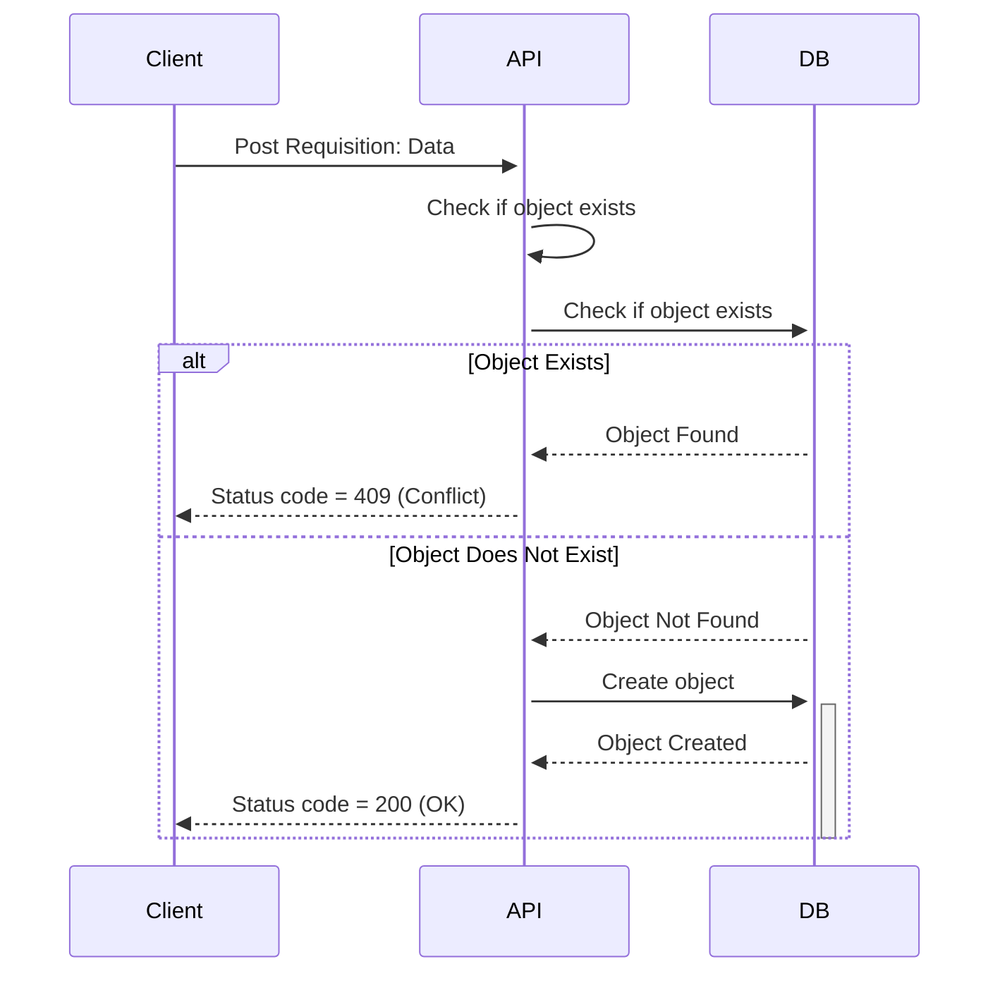
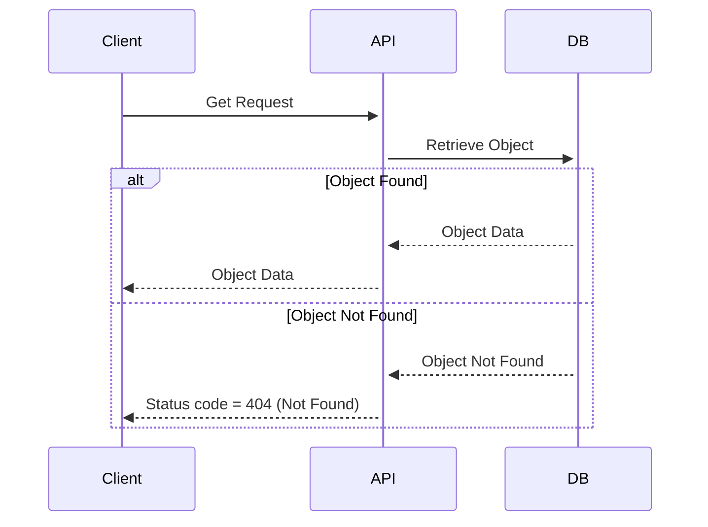
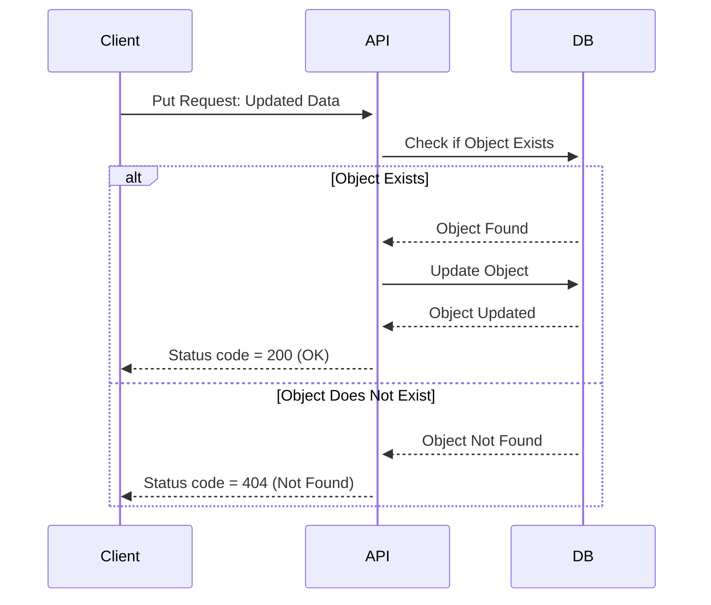
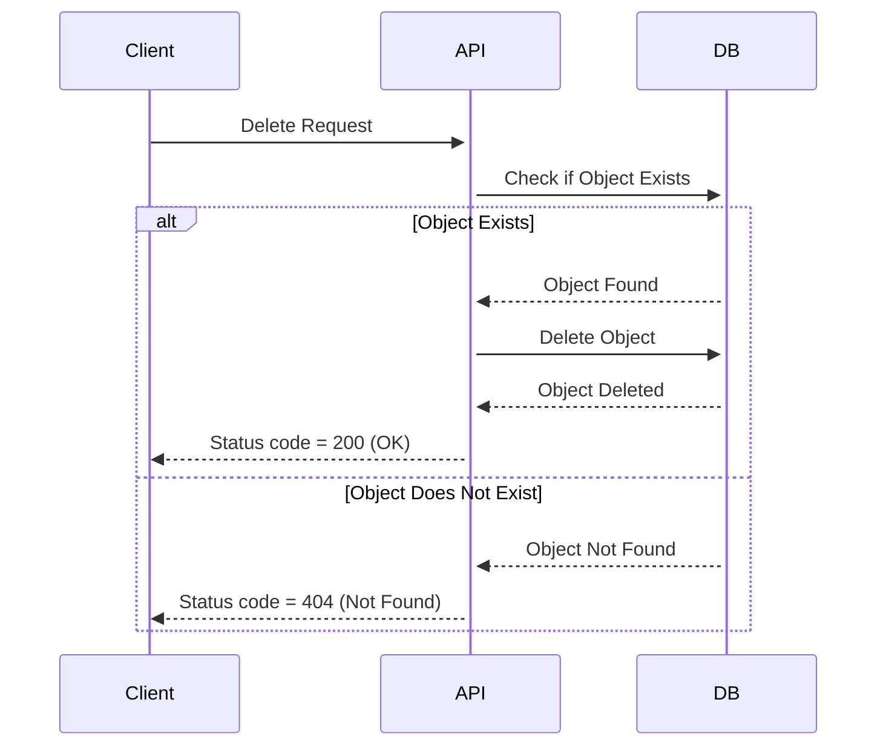
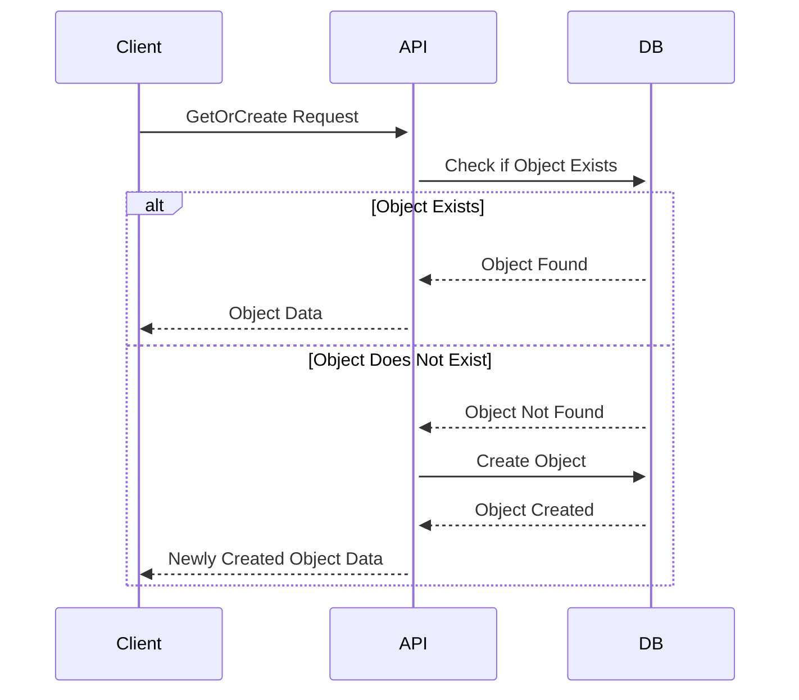
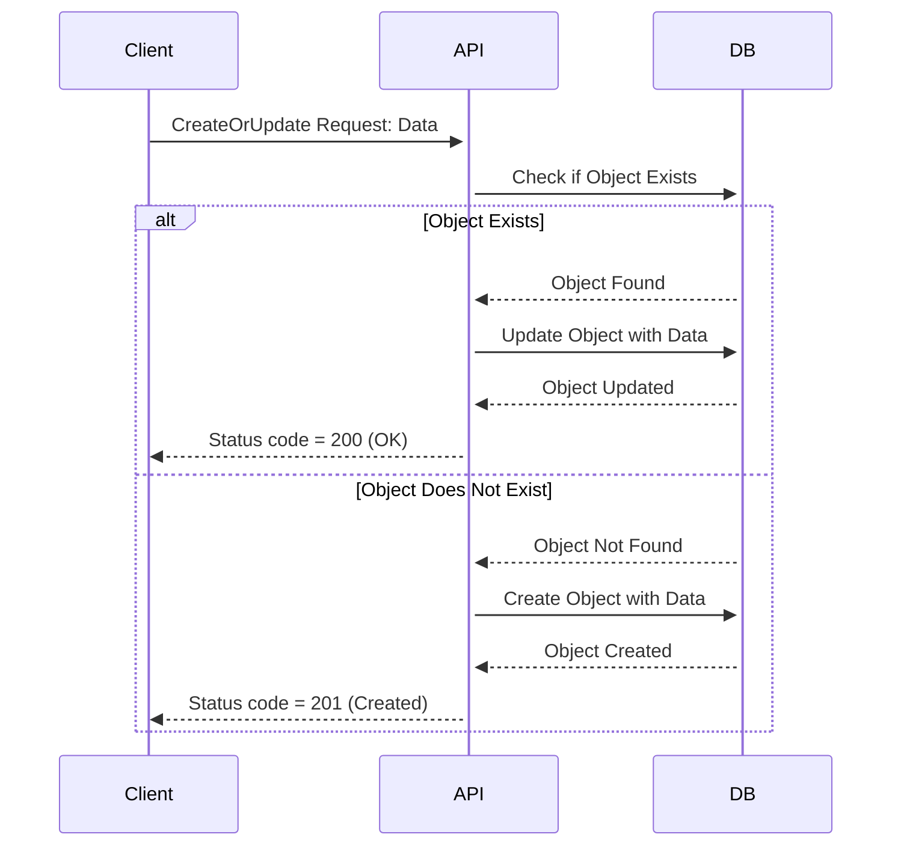

# Como rodar
1. Tenha o docker instalado na sua maquina.
2. Cria um arquivo .env dentro de TECH-CHALLENGE-1 (mesmo nivel do dockefile e doccker-compose.yml) com as seguintes variaveis:
- MYSQL_DATABASE
- MYSQL_USER
- MYSQL_PASSWORD
- MYSQL_ROOT_PASSWORD
3. Rode no terminal docker-compose up --build
4. Acesse http://127.0.0.1:8000/docs#/
5. Depois de finalizar, rode docker-compose down

# Project

- Este projeto disponibiliza dados tratados de Vitivinicultura adquiridos pela Embrapa (https://vitibrasil.cnpuv.embrapa.br/).
- Há dois packages gerais:
    - /api
    - /data

# Packages 

## data
- O Package data é responsável pela busca de dados no site da embrapa, fazendo o download dos arquivos CSV e tratamento de dados.
- O package é separado em subpackages, cada um relacionado a cada fonte de dados.

1. Comercio
2. Exportacao
3. Importacao
4. Processamento
5. Producao

- Cada subpackage é responsável pela implementação dos seus nós (nodes.py) e seu pipeline (pipeline.py)

## api
- O package da API tem uma implementação semelhante ao data.
- É formado pelos subpackages

1. Comercio
2. Exportacao
3. Importacao
4. Processamento
5. Producao
6. security 

- Cada package é responsável pela criação do seu ORM (models.py), tipagem de de endpoints (schemas.py) e endpoint (routes.py) seguindo a mesma forma de implementação.
- O package security nos da a implementação de usuarios e autenticação via token JWT para ser usada nos demais packages.

# Funcionamento dos End Points

## Post Endpoint

## Get Endpoint

## Put Endpoint

## DELETE Endpoint

## Get or Create Endpoint

## Create or Update Endpoint
