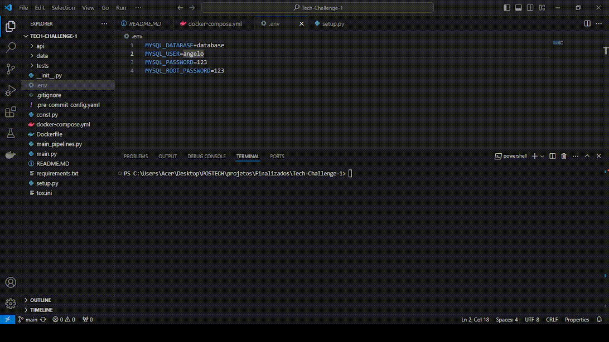
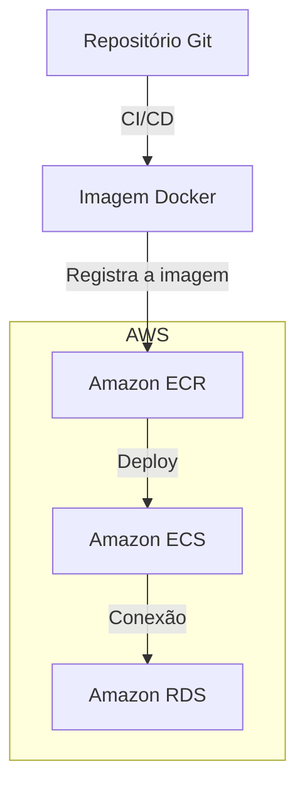
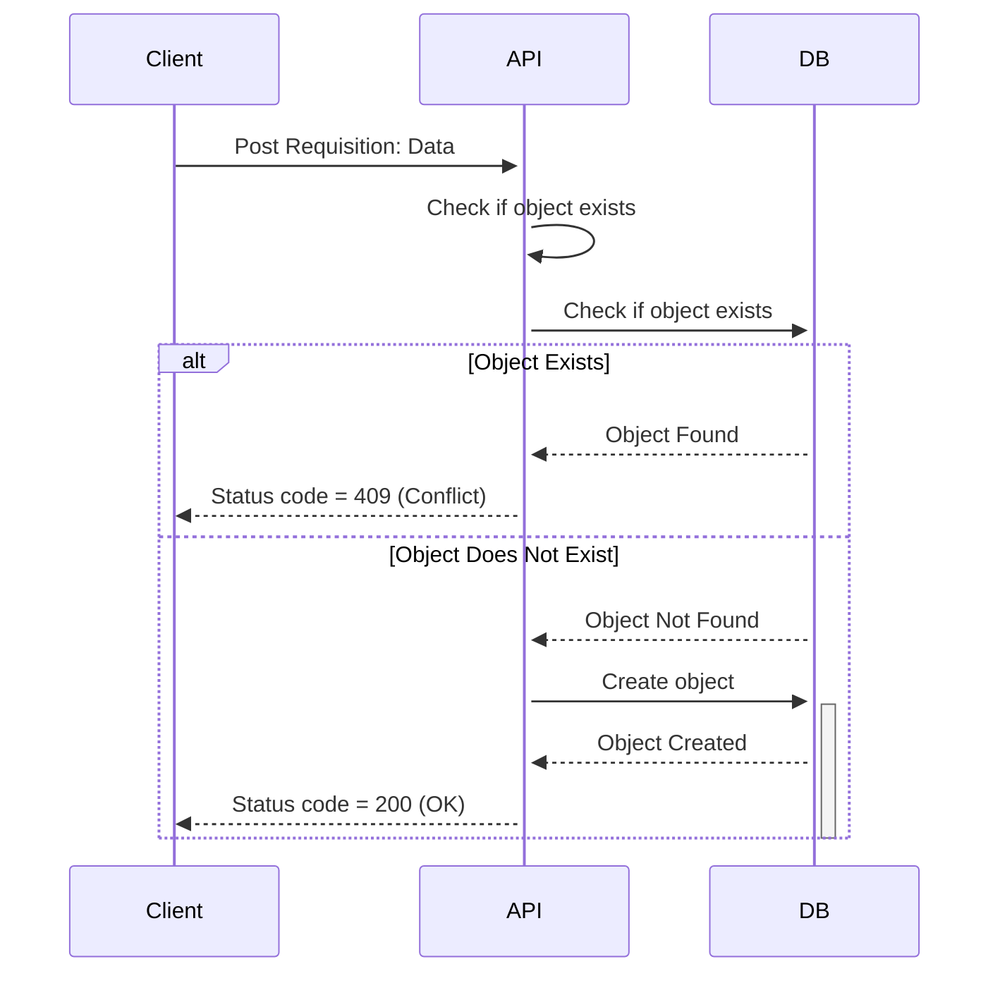
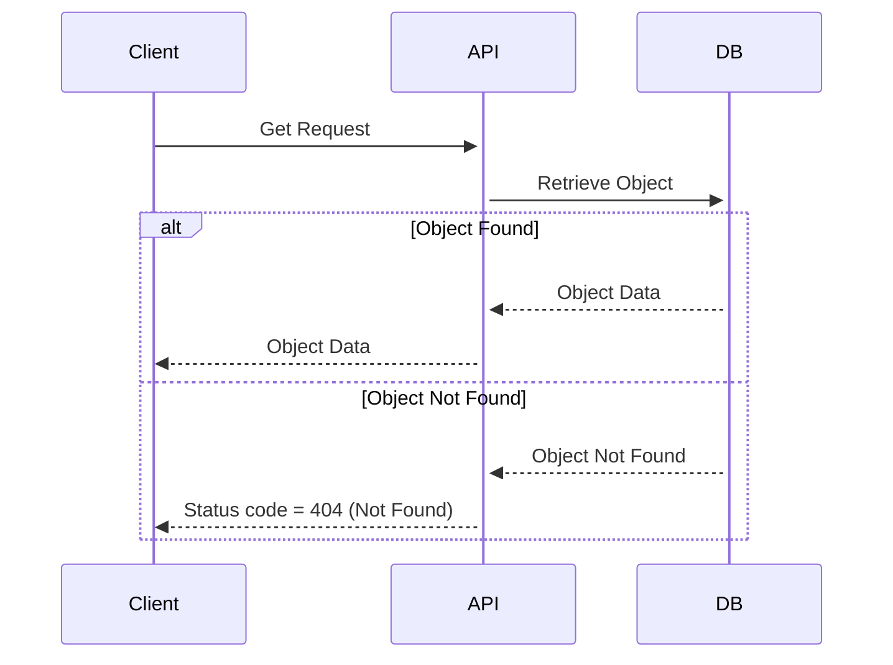
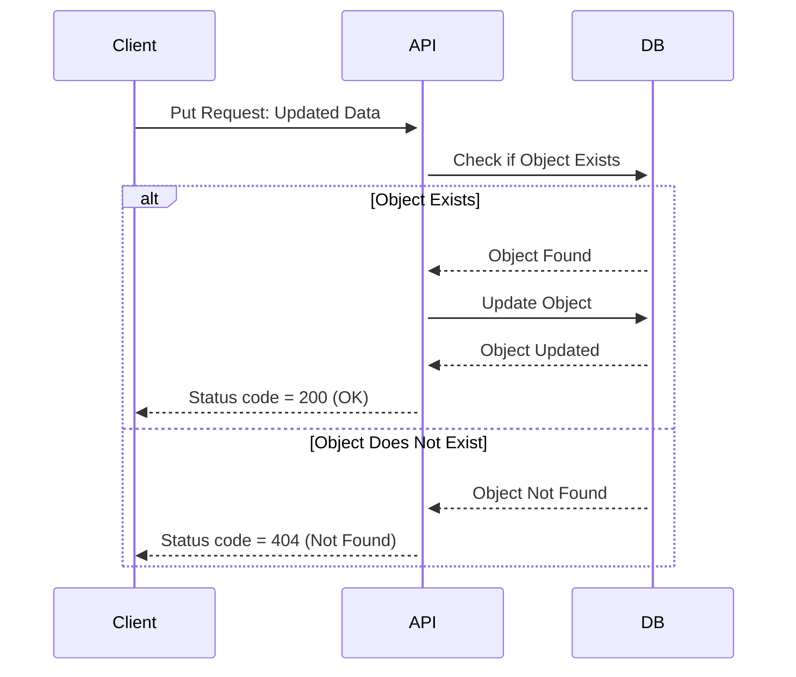
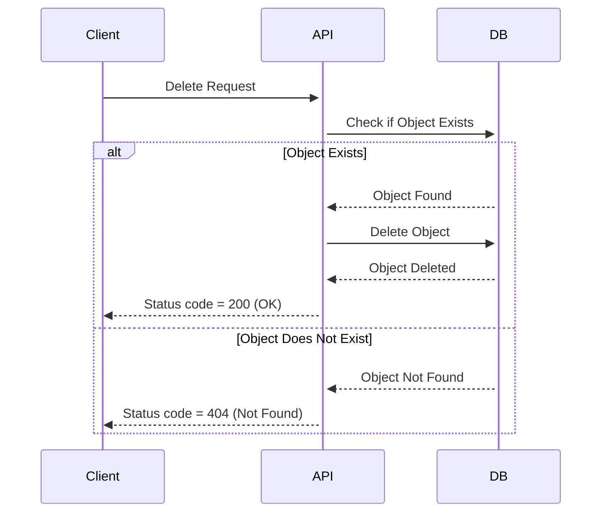
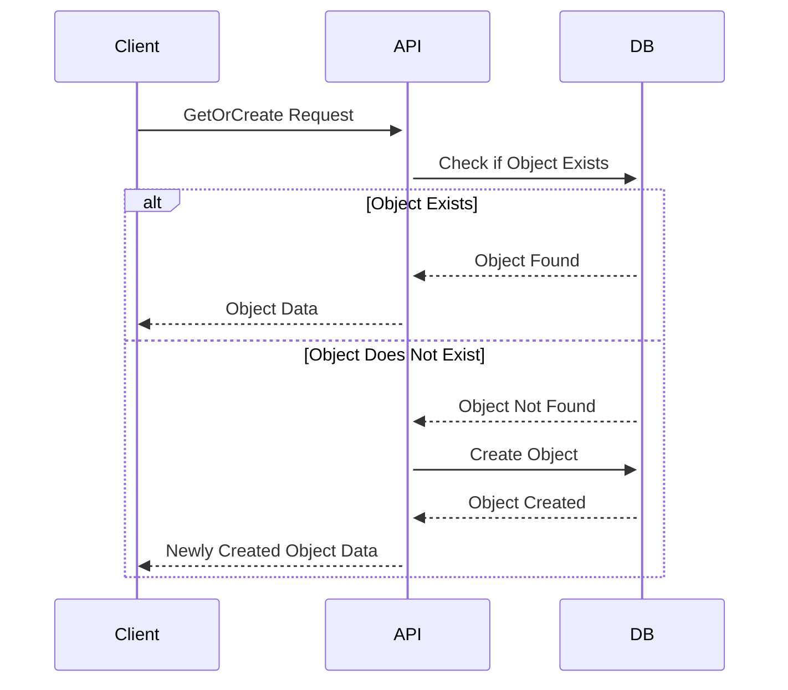
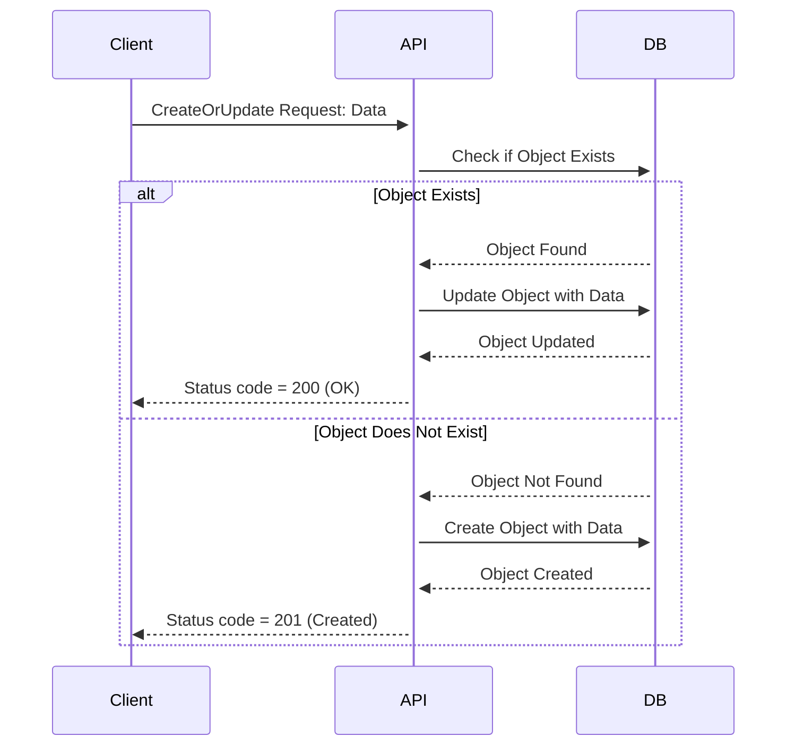

# Como rodar

1. Tenha o Docker instalado na sua máquina.
2. Crie um arquivo `.env` dentro de `TECH-CHALLENGE-1` (no mesmo nível do `Dockerfile` e `docker-compose.yml`) com as seguintes variáveis:
    - `MYSQL_DATABASE`
    - `MYSQL_USER`
    - `MYSQL_PASSWORD`
    - `MYSQL_ROOT_PASSWORD`
3. Rode no terminal o comando: `docker-compose up --build`
    - o Docker irá criar um banco de dados MySql (caso dê erro na primeira vez, rode novamente) e em seguida irá subir o API.

4. Acesse `http://127.0.0.1:8000/docs#/`
5. Crie um usuário em `/security/create` (Create User)
6. Faça login com seu usuário em `/security/token` (Login for Access Token)

7. Caso esteja em `/docs` (openapi), insira o token no canto superior direito (Authorize)

8. O token tem duração de 30 minutos. Você pode testar os endpoints de POST, DELETE e PUT durante esse tempo.
9. Os endpoints de GET estão abertos, sem necessidade de Token JWT.
10. Depois de finalizar, rode `docker-compose down`

# Deploy

- Usamos o git para armazenar o código fonte da aplicação
- Utilizamos CI/CD para construir a imagem da aplicação
- Armazenamos a imagem construida no ECR (Elastic Container Registry)
- Realizamos o Deploy no ECS (Elastic Container Service) com conexão de um banco RDS (especificação via váriavel de ambiente), isto é, sem lançar o banco de dados junto da aplicação. 

# Project

- Este projeto disponibiliza dados tratados de Vitivinicultura adquiridos pela Embrapa (https://vitibrasil.cnpuv.embrapa.br/).
- Há dois pacotes gerais:
    - `/api`
    - `/data`

# Packages

## data
- O pacote `data` é responsável pela busca de dados no site da Embrapa, fazendo o download dos arquivos CSV e tratamento de dados.
- O pacote é separado em subpacotes, cada um relacionado a uma fonte de dados específica.

1. Comercio
2. Exportacao
3. Importacao
4. Processamento
5. Producao

- Cada subpacote é responsável pela implementação dos seus nós (`nodes.py`) e seu pipeline (`pipeline.py`).

## api
- O pacote `api` tem uma implementação semelhante ao `data`.
- É formado pelos seguintes subpacotes:

1. Comercio
2. Exportacao
3. Importacao
4. Processamento
5. Producao
6. security

- Cada pacote é responsável pela criação do seu ORM (`models.py`), tipagem de endpoints (`schemas.py`) e endpoint (`routes.py`), seguindo a mesma forma de implementação.
- O pacote `security` nos dá a implementação de usuários e autenticação via token JWT para ser usada nos demais pacotes.

# Funcionamento dos End Points

## Post Endpoint

## Get Endpoint

## Put Endpoint

## DELETE Endpoint

## Get or Create Endpoint

## Create or Update Endpoint
